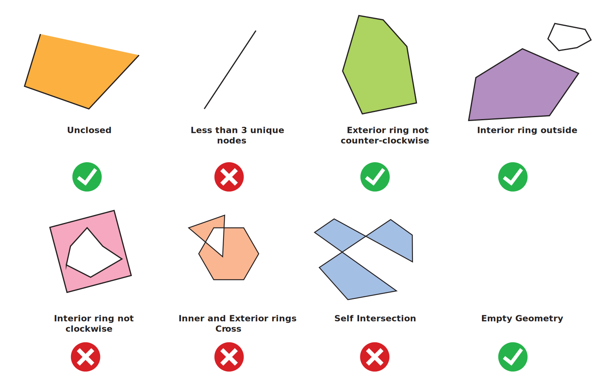

# GeoJSON Dashboard API

A small FastAPI backend that powers the Streamlit dashboard in `ui/`. It accepts a GeoJSON file, keeps it in memory for the current browser session, and exposes endpoints to inspect, validate, edit, and export it.

## How it works

Every request must include an `X-Session-ID` header (the UI generates and persists one per browser tab). `functions/session.py` keeps an in-memory `dict` keyed by that header — **each session gets its own independent dataset**, not a single shared global. There is **no database and no user accounts**, so:

- Restarting the API process loses all sessions' data.
- Two different `X-Session-ID` values never see or edit each other's data.
- A session is also dropped automatically if it's idle (no API call at all, not just no upload) for longer than `SESSION_TTL_MINUTES` (default 30). A background sweep (`sweep_idle_sessions` in `functions/session.py`, started from `main.py`'s `lifespan`) checks every 60 seconds and evicts anything past that idle threshold, so memory doesn't grow unbounded with abandoned sessions. Calling any endpoint resets that session's idle timer.

Only `Polygon` and `MultiPolygon` features are kept. Anything else (points, lines, etc.) is dropped on upload and reported in the upload summary.

Features are identified by their 0-based index in the `features` list, not a stable ID — deleting or reordering shifts every later index.

## Running locally

```bash
cd api
pip install -r requirements.txt
uvicorn main:app --reload --port 8000
```

The API is then available at `http://localhost:8000`. Interactive docs (Swagger UI) are at `http://localhost:8000/docs`.

## Running with Docker

From the repo root:

```bash
docker compose up --build -d api   # first run, or after a code change
docker compose up -d api           # subsequent runs
```

or start the whole stack (API + UI + log viewer) the same way, dropping `api` from the command — see the root [README.md](../README.md) for the full getting-started flow.

## Endpoints

| Method   | Path                                                           | Description                                                                                                                         |
| -------- | -------------------------------------------------------------- | ----------------------------------------------------------------------------------------------------------------------------------- |
| `GET`    | `/`                                                            | Health check (`{"message": "API Connected"}`).                                                                                      |
| `POST`   | `/upload/file`                                                 | Upload a `.geojson` file (multipart form, field name `file`).                                                                       |
| `GET`    | `/features`                                                    | Return all features currently in the session.                                                                                       |
| `GET`    | `/stats/area`                                                  | Total and per-feature area in hectares.                                                                                             |
| `GET`    | `/validate`                                                    | Check the geometries for structural and topology issues.                                                                            |
| `POST`   | `/fix`                                                         | Try to automatically repair invalid/problematic geometries.                                                                         |
| `GET`    | `/duplicates?remove_duplicates=false&duplicate_threshold=0.99` | Find geometries that are identical to, or spatially intersect, another one. Pass `remove_duplicates=true` to delete the duplicates. |
| `POST`   | `/features`                                                    | Add a new feature (geometry + properties).                                                                                          |
| `PUT`    | `/features/{id}/geometry`                                      | Replace the geometry of a feature.                                                                                                  |
| `PUT`    | `/features/{id}/properties`                                    | Replace the attribute table (properties) of a feature.                                                                              |
| `DELETE` | `/features/{id}`                                               | Delete a feature.                                                                                                                   |
| `GET`    | `/export`                                                      | Download the current dataset as a `.geojson` file.                                                                                  |
| `DELETE` | `/data`                                                        | Clear the session and start over.                                                                                                   |

All endpoints (except `/`) require the `X-Session-ID` header. Errors come back in the same shape: `{"message": "...", "errors": [...]}` with an appropriate HTTP status code (e.g. `400` for bad input, `404` if nothing has been uploaded yet for that session) — including FastAPI's own request-validation errors (a malformed JSON body, a query parameter out of its allowed range), which are normalized into this same shape rather than FastAPI's default `{"detail": [...]}`. `errors` is a list of details (e.g. which feature had a problem) and is empty when there is nothing extra to report.

## What gets checked, in plain terms

Validation is powered by the [`geojson_validator`](https://github.com/chrieke/geojson-validator) package, layered with three custom checks (see `functions/validate_fix.py`). There are two separate validation passes: structure checks happen automatically on upload, and geometry checks happen when you call `/validate`. The API also includes automatic fixes for the issues that can be repaired safely.



### On upload (structure checks, always run)

| Check                                                     | What it catches                                                                                                                                                                                     |
| --------------------------------------------------------- | --------------------------------------------------------------------------------------------------------------------------------------------------------------------------------------------------- |
| Valid `type`                                              | The top-level object, each feature, and each geometry must declare a `type` that's actually a real GeoJSON type (`FeatureCollection`, `Feature`, `Polygon`, `MultiPolygon`, etc.).                  |
| Required fields present                                   | A `Feature` must have `geometry` and `properties`; a `FeatureCollection` must have a `features` array.                                                                                              |
| Coordinate shape                                          | Each coordinate position must have 2–3 numbers (longitude, latitude, optional elevation) — not fewer, not more.                                                                                     |
| Geometry type filter (app-specific, not from the library) | Only `Polygon`/`MultiPolygon` features are kept. Anything else (`Point`, `LineString`, `GeometryCollection`, etc.) is rejected and listed in the upload response, the rest of the file still loads. |

### On `/validate` (geometry checks, run on demand)

| Check                                               | What it catches                                                                           | Fixable by `/fix`?                                                               |
| --------------------------------------------------- | ----------------------------------------------------------------------------------------- | -------------------------------------------------------------------------------- |
| Unclosed ring                                       | A ring's first and last point don't match.                                                | Yes                                                                              |
| Exterior ring wrong winding                         | The outer ring isn't counter-clockwise, as RFC 7946 requires.                             | Yes                                                                              |
| Interior ring wrong winding                         | A hole isn't clockwise.                                                                   | Yes                                                                              |
| Empty geometry _(custom check)_                     | `geometry` is `null` or has no coordinates.                                               | Yes — but "fixed" means the feature is deleted, since there's nothing to repair. |
| Fewer than 3 unique points                          | A degenerate ring that isn't really a polygon.                                            | No — needs to be redrawn or deleted by hand.                                     |
| Hole crosses the boundary                           | A hole's edge crosses the outer ring instead of being fully inside (or fully outside) it. | No — ambiguous, needs manual fixing.                                             |
| Self-intersecting ring _(custom check)_             | The polygon's edges cross themselves (a "bowtie" shape).                                  | No — there's no single obviously-correct fix.                                    |
| Hole entirely outside the boundary _(custom check)_ | A hole sits completely outside its own exterior ring.                                     | No — needs manual fixing.                                                        |

**The rule of thumb**: anything that's a simple mechanical fix (closing a ring, flipping winding direction, dropping something with literally nothing in it) gets auto-fixed by `/fix`. Anything where there's more than one reasonable way to fix it — a self-crossing shape, a misplaced hole, a near-empty ring — is left for a human to redraw on the Edit tab, because guessing wrong would silently corrupt the data.

### Auto-fix behavior

`POST /fix` handles only issues that can be corrected mechanically without guessing the intended shape:

| Issue key | Auto-fix action |
| --- | --- |
| `unclosed` | Adds the missing closing coordinate to the ring. |
| `exterior_not_ccw` | Rewinds the exterior ring to counter-clockwise order. |
| `interior_not_cw` | Rewinds interior rings or holes to clockwise order. |
| `empty_geometry` | Removes the feature because there is no geometry to repair. |

The following issues are intentionally not auto-fixed because the correct geometry is ambiguous:

| Issue key | Manual action needed |
| --- | --- |
| `less_three_unique_nodes` | Redraw or delete the feature. |
| `inner_and_exterior_ring_intersect` | Repair the exterior ring or hole placement by hand. |
| `self_intersection` | Reshape the polygon so edges no longer cross. |
| `hole_outside` | Move, remove, or redraw the hole inside the exterior boundary. |

### What's deliberately _not_ checked

The `geojson_validator` library can also check for coordinates outside the valid longitude/latitude range, geometries crossing the antimeridian (the 180° line), duplicate vertices within a ring, excessive coordinate precision, and excessive vertex counts — none of these are currently turned on in this app (`functions/validate_fix.py`'s `VALIDATOR_CRITERIA` doesn't include them). If you need one of these, it's a one-line addition there.

### CRS (coordinate reference system) — what RFC 7946 says, and what this app actually does

[RFC 7946](https://datatracker.ietf.org/doc/html/rfc7946) (the GeoJSON standard) section 4 is explicit: every GeoJSON coordinate is assumed to be longitude/latitude in WGS84 (`urn:ogc:def:crs:OGC::CRS84`), full stop. The older `crs` member from the 2008 GeoJSON spec was _deliberately removed_ in RFC 7946 — the spec says alternative CRSes caused too many interoperability problems, so a fully-compliant GeoJSON file shouldn't carry a `crs` member at all.

In practice, plenty of real-world `.geojson` files (often exported from older GIS tools like QGIS) still include a `crs` member anyway — sometimes pointing at a genuinely different system, like Web Mercator (`EPSG:3857`). `functions/upload.py` checks for this on every upload: if the file has no `crs` member, or its `crs.properties.name` is exactly `urn:ogc:def:crs:OGC:1.3:CRS84`, the CRS is accepted; anything else (a different EPSG code, a malformed `crs` object, etc.) is flagged as a `crs`-type error in the upload response and the session-wide CRS status (also returned from `GET /features`, so it survives a page reload). The UI reads that status to disable the Validate, Duplicates, Edit, Export, and Assistant tabs with an explicit error until a correctly-projected file is uploaded.

**Flagging is not the same as reprojecting.** Rejected/flagged files still load — the app doesn't transform their coordinates into WGS84, it just refuses to compute areas or plot positions from them until you fix the source file. Area calculations (`functions/stats.py`) and the map both assume every coordinate is already WGS84 lon/lat; there is no `pyproj`-based transformation step. Re-export the file in WGS84/CRS84 (e.g. "reproject" in QGIS) or strip its `crs` member before re-uploading.

`/fix` attempts to repair the auto-fixable subset of issues above and reports what was fixed and what is still left afterwards.

## Limitations

- **File upload only.** `/upload/file` requires an actual multipart file — there's no endpoint to submit raw GeoJSON text directly in a request body.
- **One file at a time.** `/upload/file` replaces the session's whole dataset (`set_dataset` overwrites, it doesn't merge) — uploading a second file discards the first rather than combining them. Loading several client files into one working set isn't supported yet.
- **File extension isn't enforced by the API.** `/upload/file` only checks that the content parses as GeoJSON-shaped JSON — it accepts any filename/extension, including a `.txt` or `.json` file that happens to contain valid GeoJSON. The Streamlit uploader restricts the file picker to `.geojson` client-side, but that's a UX nicety, not a server-side guarantee. KML and Shapefile (`.shp`/`.shx`/`.dbf`) content still won't parse as JSON and will be rejected as malformed, since there's no conversion step (e.g. via `fiona`/GDAL) for those formats.
- **CRS is flagged, not reprojected.** Uploads with a `crs` member other than WGS84/CRS84 are detected and block the rest of the app from trusting that session's data (see above) — but the app cannot transform non-WGS84 coordinates into WGS84 itself. The only fix today is re-exporting the source file in WGS84/CRS84.
- **In-memory sessions only.** Session data lives in a Python dictionary. It is fast and simple for a demo or internal QA tool, but restarting the API loses all uploaded data. Production use would need persistent storage such as PostGIS, PostgreSQL JSONB, object storage, or another database-backed session store.
- **No authentication or authorization.** The API trusts whoever can reach it. In production it should sit behind SSO or Cloudflare Access, and the API itself should still enforce authorization instead of relying only on the network edge.
- **Feature IDs are not stable.** Endpoints use the feature's current list index. Deleting feature `2` shifts every later feature ID. A production version should assign stable UUIDs and keep those IDs through edits and exports.
- **Duplicate detection is approximate.** Duplicates are detected by rounded WKT strings generated from Shapely geometries. This works for exact or very similar coordinate sequences, but topology-equivalent shapes with different vertex ordering, ring ordering, or small coordinate differences may not always be grouped as expected. A stronger implementation would normalize geometries and use spatial indexes.
- **Intersection detection is pairwise.** The current implementation compares each geometry to each other geometry. That is fine for small and medium files, but large datasets should use an R-tree or another spatial index.
- **Geometry updates are type-checked, not fully validated.** `PUT /features/{id}/geometry` requires `Polygon` or `MultiPolygon` and coordinates, but it does not run the full validation suite before saving. Users should run `/validate` after manual geometry JSON edits.
- **Attribute schemas are flexible.** Properties can differ by feature and there is no required schema. That is convenient for mixed farm datasets, but production teams may want required fields, data types, controlled vocabularies, and validation rules.
- **No audit trail.** Edits, fixes, and duplicate removals are logged as events, but the API does not keep a reversible history of dataset versions. Production use should add versioning, before/after diffs, and user identity in the audit log.

## Logging

Requests and unexpected errors are logged to the console (visible with `docker compose logs api` or via Dozzle — see the root README) and to a rotating file under `LOG_DIR` (default `logs`, bind-mounted to `../logs/api` on the host by `docker-compose.yml`, so they survive container removal/rebuilds, not just restarts). Any error that isn't already a handled `HTTPException` is logged with a full traceback and returns a generic `500` message to the client, so internal details are never leaked to the UI.
